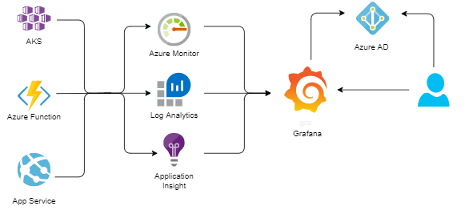

In my current project, the most of the workload is running on Azure ([Azure Kubernetes Service](https://azure.microsoft.com/nb-no/services/kubernetes-service?WT.mc_id=AZ-MVP-5003837), [Azure Functions](https://docs.microsoft.com/en-us/azure/azure-functions?WT.mc_id=AZ-MVP-5003837) and [Azure App Services](https://docs.microsoft.com/en-us/azure/app-service?WT.mc_id=AZ-MVP-5003837)) and we use [Azure Monitor](https://docs.microsoft.com/en-us/azure/azure-monitor/overview?WT.mc_id=AZ-MVP-5003837), [Azure Log Analytics](https://docs.microsoft.com/en-us/azure/azure-monitor/log-query/log-analytics-overview?WT.mc_id=AZ-MVP-5003837) and [Application Insight](https://docs.microsoft.com/en-us/azure/azure-monitor/app/app-insights-overview?WT.mc_id=AZ-MVP-5003837) to collect and analyse our logs and metrics. However, for the metrics visualization and alerts we use [Grafana](https://grafana.com/).



## Grafana terminology

Let's start by introducing some of the terms used in Grafana.

### Data source

Grafana supports many different storage back-ends for your time series data ([data-source](https://grafana.com/docs/grafana/latest/datasources/#data-sources)). Each data-source has a specific Query Editor that is customized for the features and capabilities that the particular data-source exposes.

### Dashboard

A [dashboard](https://grafana.com/docs/grafana/latest/dashboards/) is a set of one or more panels organized and arranged into one or more rows. Grafana ships with a variety of Panels. Each panel can interact with data from any configured Grafana [Data Source](https://grafana.com/docs/grafana/latest/datasources/#data-sources).
Dashboards can be tagged.

### Alert

[Alerts](https://grafana.com/docs/grafana/latest/alerting/#alerts-overview) allow you to identify problems in your system moments after they occur. By quickly identifying unintended changes in your system, you can minimize disruptions to your services.

### Users and Teams

[Users](https://grafana.com/docs/grafana/latest/manage-users/#users) are named accounts in Grafana that can be granted permissions to access resources throughout Grafana.

[Teams](https://grafana.com/docs/grafana/latest/manage-users/#teams) allow you to grant permissions for a group of users.

Grafana supports many different data-sources and, by no surprise, [Azure Monitor](https://grafana.com/docs/grafana/latest/datasources/azuremonitor/) is one of them.

## Azure Monitor data-source

The Grafana Azure Monitor data-source supports the following services:

* [Azure Monitor](https://grafana.com/docs/grafana/latest/datasources/azuremonitor/#query-the-azure-monitor-service) - the platform service that provides a single source for monitoring Azure resources.
* [Application Insights](https://grafana.com/docs/grafana/latest/datasources/azuremonitor/#query-the-application-insights-service) - an extensible Application Performance Management (APM) service for web developers on multiple platforms.
* [Azure Log Analytics](https://grafana.com/docs/grafana/latest/datasources/azuremonitor/#querying-the-azure-log-analytics-service) gives you access to log data collected by Azure Monitor.

## Teams structure

There are several independent autonomous teams and they use different Azure Monitor services to collect logs and metrics from applications and services. These Azure Monitor services are deployed to different resource groups at different subscriptions.

All teams use the same Grafana instance. To visualize their data, teams need to configure their own Grafana Data Sources, connected to the teams' Azure Monitor services. With data-sources in place, teams can create dashboards and alerts using their data-sources.

How should we organize Grafana resources in such a multi-team environment?  

## Structuring Grafana resources

Here are some of our conventions:

* Grafana instance is deployed and running inside AKS cluster
* We use Azure AD integration for Grafana. That means that users have to use their Azure AD accounts to login to Grafana. I will cover Grafana infrastructure architecture at one of the later posts.
* Users are assigned to one (or several) Grafana Teams. The same name is used for Grafana Team and Azure AD team.
* Each team has its own Dashboard folder with the same name as a Team name.
* We use Access Control List (ACL) model to [limit access](https://grafana.com/docs/grafana/latest/permissions/dashboard_folder_permissions/#dashboard-and-folder-permissions) to dashboard folder. We grant Team to their dashboard folder with Admin role and teams manage dashboards themselves.
* We use dashboard `tags` to link dashboards to the teams.

## Deployment of Grafana resources owned by the teams

For dashboards, we are currently evaluating [grafonnet](https://grafana.github.io/grafonnet-lib/). The idea is that teams implement Grafana dashboard as code and deploy them to Grafana with CI/CD pipelines. 

When it comes to data-source provisioning, there are 3 ways you can deploy data-source in Grafana:

1. Click-ops via Grafana UI
2. Use [Data source API](https://grafana.com/docs/grafana/latest/http_api/data_source/)
3. Configure the data-source with [provisioning](https://grafana.com/docs/grafana/latest/datasources/azuremonitor/#configure-the-data-source-with-provisioning)

Options 1 is not an option at all, it's a good way to learn and "play around", but can't be used for automation. Option 3 allows you to provision dashboards during Grafana deployment and this is good option for post provisioning configuration. But in our case, teams should be able to configure and deploy their data-sources themselves. Therefore we decided to go with declarative approach. That is - teams will configure their data-sources as `json` files, create a PR to the Grafana resource repository, and when PR is approved and merged, data-sources will be deployed to Grafana using Azure DevOps CI/CD pipelines.

## Azure monitor data-source configuration

Let's check what it takes to configure Azure Monitor data-source.
Azure Monitor data-source can access metrics from different services and each services can be configured individually.

### Azure Monitor service

For Azure Monitor service, you need 4 pieces of information from Azure:

* Azure AD `Tenant id`
* Azure AD application `Client Id`
* Azure AD application `Client Secret`
* Default Subscription Id

### Azure Log Analytics service

For Azure Log Analytics service, you need to provide the following configuration values:

* Azure AD `Tenant id`
* Azure AD application `Client Id`
* Azure AD application `Client Secret`
* Default `Subscription Id`
* Default `Workspace`

If you use both Azure Monitor Service and Log analytics Service at the same data-source and if Azure Monitor and Log Analytics are at the same subscription, you can use the same data-source configuration for Azure Monitor and Log Analytics services.

### Application Insights

For Application Insights you need two pieces of information:

* Application Insight `Application ID`
* Application Insight `API Key`

You can configure different combination of services at the same data-source. It may contain all three services, two of them or just one service.

## Sensitive information

We want to use `json` files for data-source configuration and store them to git repository, and we definitely don't want to hard-code sensitive information, like Azure AD Application Client secret or Application Insight API key.
We store sensitive information at Azure Key Vault, and since our teams use different Azure subscriptions for their resources, this sensitive part of data-source configuration will be distributed within different key-vaults, owned by the teams.

For instance, if team wants to add data-source for Application Insight service, they need to specify AppInsights `Application ID` and `API Key`. Since `API Key` is a sensitive information, it will be stored at one of the team's key-vault and team will provide the following information about key-vault inside data-source configuration:

* key-vault name
* key-vault resource group name
* key-vault subscription id
* key-vault secret name

If we "transform" this information to `json`, it will look like this:

```json
...
"apiKey": {
    "keyvault": {
        "name": "iac-foobar-infra-kv",
        "subscriptionId": "00000000-0000-0000-0000-000000000000",
        "resourceGroupName": "iac-app-foobar-rg",
        "secretName": "appinsight-api-key"
    }
}
...
```

## Configuration file

We decided to use one file per data-source model and here is the complete configuration file structure for `grafana-azure-monitor-datasource`:

```json
{
    "name": "",
    "environment": "",
    "team": "",
    "type": "grafana-azure-monitor-datasource",
    "monitor": {
        "subscriptionId": "",
        "tenantId": "",
        "clientId": "",
        "clientSecret": {
            "keyvault": {
                "name": "",
                "subscriptionId": "",
                "resourceGroupName": "",
                "secretName": ""
            }
        }
    },
    "logAnalytics": {
        "subscriptionId": "",
        "tenantId": "",
        "workspace": "",
        "clientId": "",
        "clientSecret": {
            "keyvault": {
                "name": "",
                "subscriptionId": "",
                "resourceGroupName": "",
                "secretName": ""
            }
        }
    },
    "appInsights": {
        "applicationId": "",
        "apiKey": {
            "keyvault": {
                "name": "",
                "subscriptionId": "",
                "resourceGroupName": "",
                "secretName": ""
            }
        }
    }
}
```

### name

the "logical" name of the data-source

### environment

Teams may have different environments for their resources and each environment may have it's own set of Azure Monitor, Log Analytics or Application Insight services. In this case, team needs to create data-source for each environment and the actual name of the data-source in Grafana will be composed as: `datasource-name-environment-ds`.

### team

name of the team owning data-source

### type

as of now, we use only one data-source type, but eventually, we may have other type of data-source (for example, prometheus). For Azure Monitor data-source, the type is set to `grafana-azure-monitor-datasource`.

### monitor

If team uses Azure Monitor service, they need to add `monitor` section and provide the following information:

* subscriptionId - Azure Monitor `Subscription Id`
* tenantId - Azure AD `Tenant Id`
* clientId - Azure AD `Application Id`
* clientSecret - reference to key-vault secret containing Azure AD Application secret

### logAnalytics

If team uses Log Analytics service, they need to add `logAnalytics` section and provide the following information:

* subscriptionId - Azure Monitor `Subscription Id`
* tenantId - Azure AD `Tenant Id`
* workspace - Log Analytics default workspace id
* clientId - Azure AD `Application Id`
* clientSecret - reference to key-vault secret containing Azure AD Application secret

### appInsights

If team uses Application Insight service, they need to add `appInsights` section and provide the following information:

* applicationId - Application Insight `Application Id`
* apiKey - reference to key-vault secret containing Application Insight `API Key`

## Provisioning script

We use bash with [`jq`](https://stedolan.github.io/jq/) to work with `json`, `az cli` to work with Azure key-vault and `curl` to call Grafana rest API, and here is what provisioning script does:

* Reads input parameters
* Reads Grafana admin user password from the key-vault
* Identifies user or spn Azure AD object id
* Reads json configuration from the data-source file
* Parses `name`, `type` and `team` information
* If data-source contains `monitor` section, parses it and extracts all configuration values. Reads `clientSecret` property value from the key-vault.
* If data-source contains `logAnalytics` section, parses it and extracts all configuration values. Reads `clientSecret` property value from the key-vault.
* If data-source contains `appInsights` section, parses it and extracts all configuration values. Reads `apiKey` property value from the key-vault.
* Replaces all placeholders with actual values in datasource template file
* Checks if data-source already exists
* If it does, updates existing data-source
* If it doesn't, creates a new data-source

Here are some fragments of the script, and sorry for my `bash`:

```bash
...

function parseSecretValue() {
    secretSectionJson=$1
    secretValue=""
    keyvaultName=$(echo ${secretSectionJson} | jq -r .keyvault.name)
    keyvaultSubscriptionId=$(echo ${secretSectionJson} | jq -r .keyvault.subscriptionId)
    keyvaultResourceGroupName=$(echo ${secretSectionJson} | jq -r .keyvault.resourceGroupName)
    keyvaultSecretName=$(echo ${secretSectionJson} | jq -r .keyvault.secretName)
    echo -e "Reading ${keyvaultSecretName} secret from ${keyvaultName}(${keyvaultSubscriptionId})"
    secretValue=$(az keyvault secret show -n ${keyvaultSecretName} --vault-name ${keyvaultName} --subscription ${keyvaultSubscriptionId} --query value -o tsv)
}

echo -e "Reading data source configuration from ${datasourceFile} file"
json=$(jq -r '.' ${datasourceFile})

name=$(echo $json | jq -r .name)
team=$(echo $json | jq -r .team)
type=$(echo $json | jq -r .type)
environment=$(echo $json | jq -r .environment)

echo -e "Check if data source contains Monitor section"
if [[ $(echo $json | jq 'has("monitor")') == true ]]; then
    echo -e "Monitor section exists, parsing configuration"
    subscriptionId=$(echo ${json} | jq -r .monitor.subscriptionId)
    tenantId=$(echo ${json} | jq -r .monitor.tenantId)
    clientId=$(echo ${json} | jq -r .monitor.clientId)
    if [[ $(echo $json | jq .monitor | jq 'has("clientSecret")') = true ]]; then
        parseSecretValue "$(echo $json | jq .monitor.clientSecret)"
        clientSecret=${secretValue}
    else
        echo -e "No clientSecret information specified. Aborting..."
    fi
else
    echo -e "Monitor section isn't configured..."
    subscriptionId=""
    tenantId=""
    clientId=""
    clientSecret=""
fi

...

dataSourceName="${name}-${environment}-ds"
echo -e "Check if $dataSourceName already exists"
dataSourceId=$(curl -s -u admin:${adminPassword} \
        -X GET "$grafanaRestAPIUrl/api/datasources/name/${dataSourceName}" \
        -H 'content-type: application/json' \
        -H 'accept: application/json' | jq .id -r)
if [[ ${dataSourceId} == "null" ]]; then
    dataSourceId=0
fi

echo -e "Transforming azure-monitor-datasource-template.json to azure-monitor-datasource.json"
cat ./templates/azure-monitor-datasource-template.json | \
     sed -e 's|{dataSourceId}|'${dataSourceId}'|g' | \
     sed -e 's|{dataSourceName}|'"${dataSourceName}"'|g' | \
     sed -e 's|{clientId}|'"${clientId}"'|g' | \
     sed -e 's|{clientSecret}|'"${clientSecret}"'|g' | \
     sed -e 's|{subscriptionId}|'"${subscriptionId}"'|g' | \
     sed -e 's|{tenantId}|'"${tenantId}"'|g'  | \
     sed -e 's|{logAnalyticsDefaultWorkspace}|'"${logAnalyticsDefaultWorkspace}"'|g'  | \
     sed -e 's|{logAnalyticsClientId}|'"${logAnalyticsClientId}"'|g'  | \
     sed -e 's|{logAnalyticsClientSecret}|'"${logAnalyticsClientSecret}"'|g'  | \
     sed -e 's|{logAnalyticsSubscriptionId}|'"${logAnalyticsSubscriptionId}"'|g'  | \
     sed -e 's|{logAnalyticsTenantId}|'"${logAnalyticsTenantId}"'|g'  | \
     sed -e 's|{appInsightsAppId}|'"${appInsightsAppId}"'|g'  | \
     sed -e 's|{appInsightsApiKey}|'"${appInsightsApiKey}"'|g'  > "${dataSourceName}.json"

if [[ ${dataSourceId} == 0 ]]; then
    echo -e "Deploying new grafana Data Source ${dataSourceName} from ${dataSourceName}.json file using ${grafanaRestAPIUrl} rest API"
    dataSourceId=$(curl -s -u admin:${adminPassword} \
            -X POST "$grafanaRestAPIUrl/api/datasources" \
            -H 'content-type: application/json' \
            -H 'accept: application/json' \
            --data-binary "@${dataSourceName}.json" | jq .datasource.id -r)
else
    echo -e "Updating grafana Data Source ${dataSourceName}(${dataSourceId}) from ${dataSourceName}.json file using ${grafanaRestAPIUrl} rest API"
    dataSourceId=$(curl -s -u admin:${adminPassword} \
            -X PUT "$grafanaRestAPIUrl/api/datasources/${dataSourceId}" \
            -H 'content-type: application/json' \
            -H 'accept: application/json' \
            --data-binary "@${dataSourceName}.json" | jq .datasource.id -r)
fi
...
```

and here is the data-source template file

```json
{
    "id": {dataSourceId},
    "name": "{dataSourceName}",
    "type": "grafana-azure-monitor-datasource",
    "access": "proxy",
    "isDefault": false,
    "basicAuth": false,
    "jsonData": {
        "clientId": "{clientId}",
        "cloudName": "azuremonitor",
        "subscriptionId": "{subscriptionId}",
        "tenantId": "{tenantId}",
        "azureLogAnalyticsSameAs": false,
        "logAnalyticsClientId": "{logAnalyticsClientId}",
        "logAnalyticsDefaultWorkspace": "{logAnalyticsDefaultWorkspace}",
        "logAnalyticsSubscriptionId": "{logAnalyticsSubscriptionId}",
        "logAnalyticsTenantId": "{logAnalyticsTenantId}",
        "appInsightsAppId": "{appInsightsAppId}"
    },
    "secureJsonData": {
        "clientSecret": "{clientSecret}",
        "logAnalyticsClientSecret": "{logAnalyticsClientSecret}",
        "appInsightsApiKey": "{appInsightsApiKey}"
    }
}
```

### Example

My team uses Application Insight called `iac-foobar-dev-ai` deployed to `iac-foobar-dev-rg`. We use `iac-foobar-dev-infra-kv` to infrastructure related sensitive configuration elements.
If I want to create new data-source with Application Insight service to Grafana, I will need to find 2 Application Insight information elements:

* Application Insight `Application ID`
* Create new `API Key`

### Find Application Insight Application ID

You can find your Application Insight Application ID at the portal under `API Access` right menu item. Or you can use `az cli` to get this information.

```bash
az monitor app-insights component show --app iac-foobar-dev-ai -g iac-foobar-dev-rg --query appId -o tsv
```

Note, you may need to install `application-insights` `az cli` extension:

```bash
az extension add -n application-insights
```

### Create API Key and store it to key-vault

You can create new API Key from the portal at the `API Access` page. And you can copy value and cerate new secret at the key-vault.

Or you can use `az cli` to both create new API key and store it to the key-vault:

```bash
apiKey=$(az monitor app-insights api-key create --app iac-foobar-dev-ai --api-key grafana-key -g iac-foobar-dev-rg --query apiKey --read-properties ReadTelemetry -o tsv)
az keyvault secret set -n appinsight-api-key --vault-name iac-foobar-dev-infra-kv --value ${apiKey}
```

Now I need to create new `foobar-dev.json` file with the following content:

```json
{
    "name": "foobar",
    "team": "dev",
    "type": "grafana-azure-monitor-datasource",
    "appInsights": {
        "applicationId": "application-id-value",
        "apiKey": {
            "keyvault": {
                "name": "iac-foobar-dev-infra-kv",
                "subscriptionId": "00000000-0000-0000-0000-000000000000",
                "resourceGroupName": "iac-foobar-dev-rg",
                "secretName": "appinsight-api-key"
            }
        }
    }
}

```

With this file in place, I can deploy my data-source to the `test` Grafana instance by executing the following script:

```bash
./deploy-azure-monitor-datasource.sh test foobar-dev.json
```

## Useful links

* [Grafana data-source provisioning](https://grafana.com/docs/grafana/latest/administration/provisioning/#datasources)
* [Grafana Data-source API](https://grafana.com/docs/grafana/latest/http_api/data_source/)
* [Grafana Azure Monitor data-source](https://grafana.com/docs/grafana/latest/features/datasources/azuremonitor/)
* [Grafana Alerts](https://grafana.com/docs/grafana/latest/alerting/alerts-overview/)
* [jq - a lightweight and flexible command-line JSON processor](https://stedolan.github.io/jq/)

With that - thanks for reading!
