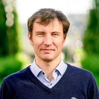

## Hi, my name is Evgeny Borzenin

I am an Azure Solutions Architect Expert, Microsoft Azure Community Hero, technical architect and developer with more than 20 years of experience, strong communication skills and love of automation.

I am currently working as an consultant at [Konsulentselskapet Ensō AS](https://enso.no/) and my current assignment is at [Vipps AS](https://vipps.no/).

I have very strong development background working with complex distributed back-end systems at the medium to big size enterprises at the financial sector. For the past 5 years my focus has shifted towards Azure infrastructure, mainly because I feel that cloud in general becomes an central component of any IT and I believe that Azure, as an cloud provider, is one of the strongest player at the market.

To build up my Azure competence, I completed [AZ-300](https://docs.microsoft.com/en-us/learn/certifications/exams/az-300) and [AZ-301](https://docs.microsoft.com/en-us/learn/certifications/exams/az-301) certification exams in 2019 and became an [Azure Solutions Architect Expert](https://docs.microsoft.com/en-us/learn/certifications/azure-solutions-architect).

You can also check my [Sessionize](https://sessionize.com/evgeny-borzenin) and [LinkedIn](https://www.linkedin.com/feed/?trk=nav_back_to_linkedin) profiles.

If you have any questions please reach out to me at evgeny.borzenin@gmail.com.
